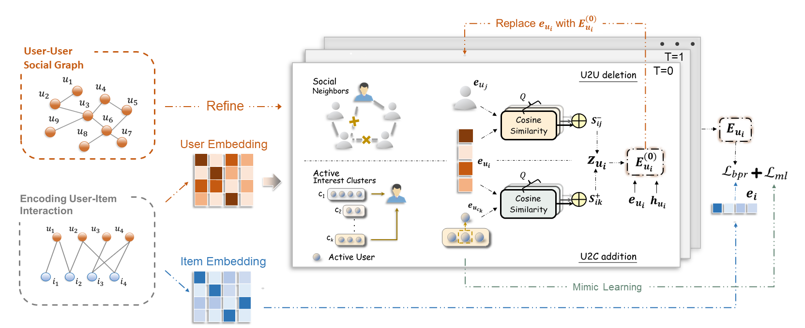

# LSIR
Code of our DASFAA 2024 paper ["Learning Social Graph for Inactive User Recommendation". ](https://arxiv.org/abs/2405.05288)

Authors: Nian Liu, Shen Fan, Ting Bai, Peng Wang, Mingwei Sun, Yanhu Mo, Xiaoxiao Xu, Hong Liu, Chuan Shi



# Environment Settings
```
torch==1.13.1

GPU: Tesla-V100, Memory 32G
CPU: Intel(R) Xeon(R) Platinum 8163 CPU @2.50GHz
```

# Usage
First, download datasets from [<https://drive.google.com/drive/folders/12L7Je7p_xQdoPkVxoxqc3mVob24qGrgw?usp=drive_link>](https://drive.google.com/drive/folders/12L7Je7p_xQdoPkVxoxqc3mVob24qGrgw?usp=sharing). Then, unzip the datasets into the folder /dataset.

Running the following command:
```
CUDA_DEVICES_VISIBLES=0 python main.py yelp

CUDA_DEVICES_VISIBLES=0 python main.py flickr
```

